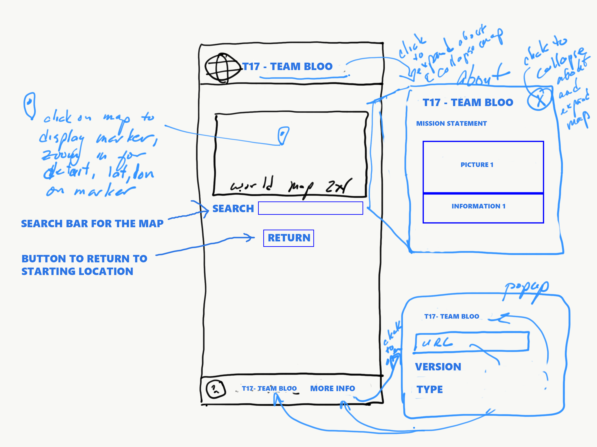
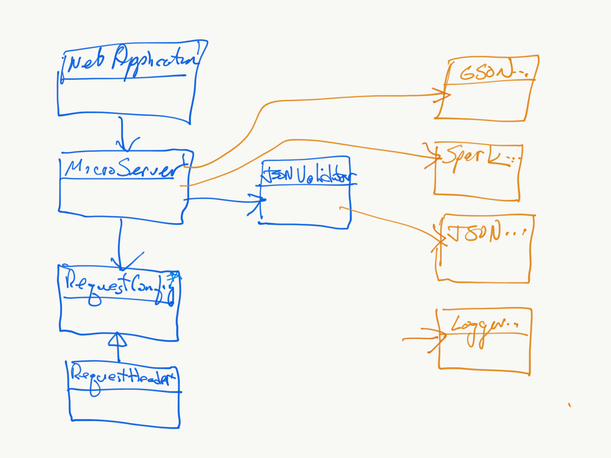

# Introduction

This document describes the architecture and design of a single page web application that interacts with microservices via RESTful APIs.
The key elements in this document include the architecture, user interface, client components, and server classes.

This is a living document that is updated as changes are made each sprint.
The initial document describes the Base code students are given as a starting point for the semester.
Students are expected to update this document as changes are made each sprint to reflect the evolution of their application and key decisions they make.
The Base section serves as an example.

# Base

The Base is a simple application to provide the architecture to the students at the beginning of the semester.
The JavaScript code will be useful examples for students to learn from and leverage in the code they write for sprint 1.
The progressive display of information using collapsible sections and popups will serve as examples of good user interface design.
The overall design is somewhat minimalist/simple for the intended mobile device audience.

# Sprint 1
We added our team name to all the sections that needed the update. We also added a get more info clickable at the bottom instead of a url to make it easier to read. Once the info is clicked there is information about the name, URL, version, and type. Also, the name at the top of the page can be clicked to go to the team about page. Here we have information regard ing the members of Team Bloo and a picture of them. The mission statement also appears on this page. The page can be closed either by clicking the team name at the top or the close button on the right side of the screen.

### Architecture

The Base architecture is a JavaScript single page web application in an HTML5 browser that uses RESTful APIs to access Micro-services provided by a Java server running on Linux.
The client consists of a minimal index.html file that loads and executes the bundled JavaScript application.
The client and server files are bundled into a single JAR file for execution on the Linux server at a specified port.
The browser fetches the client files from the server on the specified port.

The browser loads the index.html file (by default) which in turn loads the bundled JavaScript single page application bundle.js.
* The single page application makes RESTful API requests to the server on the same port using  JavaScript's asynchronous fetch.  
* A protocol document describes the JSON format for the RESTful API requests and responses.
* JSON Schemas are used to verify requests on the server side and responses on the client side.
* On the client, ReactJS renders the application using ReactStrap, Leaflet, and application defined components.
* GSON is used on the server to convert JSON requests to Java objects and Java objects to JSON responses.
* The client (ulog) and server (SLF4J) logging mechanisms control debugging output during development and production - print statements and console logging should never be used. 

The following architecture elements are not included in the Base system.
They will be added later in the semester.
* Client filesystem .
* Server SQL .
* Server concurrency.

### User Interface

The basic screen in black shows the view on a mobile device, with a header, footer, and map.
The header contains a earth logo and the team name obtained from the server when the client was loaded.
The footer contains a connection icon along with the current server name and server URL the client is connected to.
The blue areas highlight the actions that may be performed.

Rather than buttons or icons to signify actions, we are associating actions with elements that are already on the screen to reduce the clutter.
We are using both popups and collapsible sections in this design rather than choosing to use one exclusively.
* Collapsible/Hidden sections are used for the map and about sections since they have a significant amount of content and we don't need to see them at the same time.
* A popup is used for the URL change since we want to control the interaction until the operation is completed. It seemed more natural than another collapsible section.

#### Clicking on the map places a marker.
Whenever a user clicks on the map, the client should display a marker with latitude and longitude at that location.
We only maintain a single marker at this point displaying the most recently clicked location.

#### Clicking on the team name should tell me more about the team.
Whenever a user clicks the team name in the header, a collapsible section should appear under the header with information about the team.
The collapsible map should disappear so only the about or map are displayed.
A close button / icon in the top right corner of the about will close the about and return the map to display.
A simple toggle in state should be able to control this rendering.
The about page should contain the team name as a heading, but be otherwise blank in base. 

#### Clicking on the URL in the footer should let me change the server.
Whenever a user clicks on the URL a popup should open showing the team name, the URL in an input text box, and a Cancel button.
When the user modifies the URL, a Test button should appear and the server name should disappear.
When the Test button is clicked, it will attempt to connect to the server.
If not successful, nothing changes and the user may continue to make URL changes or click the Cancel button to return to the original sever (it shouldn't change).
If successful, the new server name should appear and a Save button should replace the Test button.
When the user clicks the Save button, the server connection should change and the popup closes, revealing the new servername and URL in the footer.

### Component Hierarchy
The component hierarchy for the base application depicted below shows the our top level App component with four children components.
* App renders the major components on the screen.
* Header renders an icon and a team name in the top banner.
* Footer renders the current server connection in the bottom footer.
* Atlas renders a map.
* About renders information about the team.

We do not show the many ReactStrap components in this hierarchy, even though they will appear when you are debugging on the client.

### Class Diagram
The class diagram for the base application depicted below shows the basic structure of the web server application.

The classes in blue represent the classes specific to this application.  
* WebApplication processes command line parameters and creates MicroServer.
* MicroServer start a web server on the given port, configures the server for security, static files, and APIs for different types of requests, and processes the requests as they arrive.
* JSONValidator verifies a request is properly formatted before attempting to process it using JSON Schemas.
* RequestConfig is a specific request that allows the server to respond with its configuration to allow interoperability between clients and servers. 
* RequestHeader defines the basic components of all requests.

The classes in orange represent the external libraries used by the application.
Often there are several related classes but we've listed only one to simplify the diagram.
* GSON converts a JSON string into a Java object instance.
* Spark provides the necessary web support for our MicroServer.
* JSON provides libraries to manipulate JSON objects using the JSON Schema libraries.
* Logger provides a centralized logging facility used in all of the application classes.

# Sprint 2
For sprint 2 we added both distance and find .json requests along with their appropriate needed files to help them run. We also added a return to current location button and a search button to the map. The search button uses the find request to show locations relating to the search. Adding to that, we added buttons that generate below the map that allow us to select which two locations we want in order to get the distance. Finally, we added a distance button that when clicked after selecting two locations will provide the distance in miles to the user.

### Architecture

The Base architecture is a JavaScript single page web application in an HTML5 browser that uses RESTful APIs to access Micro-services provided by a Java server running on Linux.
The client consists of a minimal index.html file that loads and executes the bundled JavaScript application.
The client and server files are bundled into a single JAR file for execution on the Linux server at a specified port.
The browser fetches the client files from the server on the specified port.

The browser loads the index.html file (by default) which in turn loads the bundled JavaScript single page application bundle.js.
* The single page application makes RESTful API requests to the server on the same port using  JavaScript's asynchronous fetch.  
* A protocol document describes the JSON format for the RESTful API requests and responses.
* JSON Schemas are used to verify requests on the server side and responses on the client side.
* On the client, ReactJS renders the application using ReactStrap, Leaflet, and application defined components.
* GSON is used on the server to convert JSON requests to Java objects and Java objects to JSON responses.
* The client (ulog) and server (SLF4J) logging mechanisms control debugging output during development and production - print statements and console logging should never be used. 

The following architecture elements are not included in the Base system.
They will be added later in the semester.
* Client filesystem .
* Server SQL .
* Server concurrency.

### User Interface

The basic screen in black shows the view on a mobile device, with a header, footer, and map.
The header contains a earth logo and the team name obtained from the server when the client was loaded.
The footer contains a connection icon along with the current server name and server URL the client is connected to.
The blue areas highlight the actions that may be performed.

Rather than buttons or icons to signify actions, we are associating actions with elements that are already on the screen to reduce the clutter.
We are using both popups and collapsible sections in this design rather than choosing to use one exclusively.
* Collapsible/Hidden sections are used for the map and about sections since they have a significant amount of content and we don't need to see them at the same time.
* A popup is used for the URL change since we want to control the interaction until the operation is completed. It seemed more natural than another collapsible section.

#### Clicking on the map places a marker.
Whenever a user clicks on the map, the client should display a marker with latitude and longitude at that location.
We only maintain a single marker at this point displaying the most recently clicked location.

#### Clicking on the team name should tell me more about the team.
Whenever a user clicks the team name in the header, a collapsible section should appear under the header with information about the team.
The collapsible map should disappear so only the about or map are displayed.
A close button / icon in the top right corner of the about will close the about and return the map to display.
A simple toggle in state should be able to control this rendering.
The about page should contain the team name as a heading, but be otherwise blank in base. 

#### Clicking on the search button brings up a search box.
Whenever a user clicks the magnifying glass on the map, a search box will appear and allow the user to input a location to look up. 
A series of results will pop up allowing the user to select an option. 
A close button / icon in the top right corner or cancel in the lower left corner of the search box will close the box and return the map to display.

#### Clicking on Current Location button brings users map to current location.
Whenever a user clicks the current location button on the map, the map will center on the current location. 

#### Clicking on the Locations sets the values for the distance button.
Whenever a user a selected location below, it will add the location for distance to use.

#### Clicking on the Distance button shows distance between the two selected locations.
Whenever a user selects the distance button after selecting 2 locations, it will display the distance in the button.
If no two locations are selected, then distance will not update.

#### Clicking on the (i)Get more info in the footer should let me change the server.
Whenever a user clicks on the URL a popup should open showing the team name, the URL in an input text box, and a Cancel button.
When the user modifies the URL, a Test button should appear and the server name should disappear.
When the Test button is clicked, it will attempt to connect to the server.
If not successful, nothing changes and the user may continue to make URL changes or click the Cancel button to return to the original sever (it shouldn't change).
If successful, the new server name should appear and a Save button should replace the Test button.
When the user clicks the Save button, the server connection should change and the popup closes, revealing the new servername and URL in the footer.

### Component Hierarchy
The component hierarchy for the base application depicted below shows the our top level App component with four children components.
* App renders the major components on the screen.
* Header renders an icon and a team name in the top banner.
* Footer renders the current server connection in the bottom footer.
* Atlas renders a map.
* About renders information about the team.

We do not show the many ReactStrap components in this hierarchy, even though they will appear when you are debugging on the client.

### Class Diagram
The class diagram for the base application depicted below shows the basic structure of the web server application.

The classes in blue represent the classes specific to this application.  
* WebApplication processes command line parameters and creates MicroServer.
* MicroServer start a web server on the given port, configures the server for security, static files, and APIs for different types of requests, and processes the requests as they arrive.
* JSONValidator verifies a request is properly formatted before attempting to process it using JSON Schemas.
* RequestConfig is a specific request that allows the server to respond with its configuration to allow interoperability between clients and servers. 
* RequestDistance is a specific request that allows the server to respond with the distance between two locations.
* RequestFind is a specific request that allows the server to respond with the results of the item searched.
* DistanceCalcuator calculates the distance between two locations given to it by RequestDistance
* Database accesses the database and gives the search result to RequestFind
* RequestHeader defines the basic components of all requests.

The classes in orange represent the external libraries used by the application.
Often there are several related classes but we've listed only one to simplify the diagram.
* GSON converts a JSON string into a Java object instance.
* Spark provides the necessary web support for our MicroServer.
* JSON provides libraries to manipulate JSON objects using the JSON Schema libraries.
* Logger provides a centralized logging facility used in all of the application classes.

# Sprint 3
For Sprint 3 we added trips and the UI to support it. First we moved the location list to it's own button on the atlas. This allowed us to have space for trip, and made adding to trip easier than directly from search bar to trip. In search bar we can add locations to the locations list, this way were not adding directly to trip and making a mess of our list. Trip is now under our atlas, This displays the trip name, Total Distance, Distnaces, and our locations in our trip. We have the ablity to reorder our trip by drag and drop, this changes the order of the polylines and corrects the distances. In our drag and drop locations we have the ablity to delete the location or see more info about it. In our trip Hamburger option button we have the ablitly Calculate, Save, Clear, and Load. Thats most of what we added this sprint 3.

### Architecture

The Base architecture is a JavaScript single page web application in an HTML5 browser that uses RESTful APIs to access Micro-services provided by a Java server running on Linux.
The client consists of a minimal index.html file that loads and executes the bundled JavaScript application.
The client and server files are bundled into a single JAR file for execution on the Linux server at a specified port.
The browser fetches the client files from the server on the specified port.

The browser loads the index.html file (by default) which in turn loads the bundled JavaScript single page application bundle.js.
* The single page application makes RESTful API requests to the server on the same port using  JavaScript's asynchronous fetch.  
* A protocol document describes the JSON format for the RESTful API requests and responses.
* JSON Schemas are used to verify requests on the server side and responses on the client side.
* On the client, ReactJS renders the application using ReactStrap, Leaflet, and application defined components.
* GSON is used on the server to convert JSON requests to Java objects and Java objects to JSON responses.
* The client (ulog) and server (SLF4J) logging mechanisms control debugging output during development and production - print statements and console logging should never be used. 

The following architecture elements are not included in the Base system.
They will be added later in the semester.
* Client filesystem .
* Server SQL .
* Server concurrency.

### User Interface

The basic screen in black shows the view on a mobile device, with a header, footer, and map.
The header contains a earth logo and the team name obtained from the server when the client was loaded.
The footer contains a connection icon along with the current server name and server URL the client is connected to.
The blue areas highlight the actions that may be performed.

Rather than buttons or icons to signify actions, we are associating actions with elements that are already on the screen to reduce the clutter.
We are using both popups and collapsible sections in this design rather than choosing to use one exclusively.
* Collapsible/Hidden sections are used for the map and about sections since they have a significant amount of content and we don't need to see them at the same time.
* A popup is used for the URL change since we want to control the interaction until the operation is completed. It seemed more natural than another collapsible section.

#### Clicking on the map places a marker.
Whenever a user clicks on the map, the client should display a marker with latitude and longitude at that location.
We only maintain a single marker at this point displaying the most recently clicked location.

#### Clicking on the team name should tell me more about the team.
Whenever a user clicks the team name in the header, a collapsible section should appear under the header with information about the team.
The collapsible map should disappear so only the about or map are displayed.
A close button / icon in the top right corner of the about will close the about and return the map to display.
A simple toggle in state should be able to control this rendering.
The about page should contain the team name as a heading, but be otherwise blank in base. 

#### Clicking on the search button brings up a search box.
Whenever a user clicks the magnifying glass on the map, a search box will appear and allow the user to input a location to look up. 
A series of results will pop up allowing the user to select an option. 
A close button / icon in the top right corner or cancel in the lower left corner of the search box will close the box and return the map to display.

#### Clicking on Current Location button brings users map to current location.
Whenever a user clicks the current location button on the map, the map will center on the current location. 

#### Clicking on the Locations sets the values for the distance button.
Whenever a user a selected location below, it will add the location for distance to use.

#### Clicking on the Distance button shows distance between the two selected locations.
Whenever a user selects the distance button after selecting 2 locations, it will display the distance in the button.
If no two locations are selected, then distance will not update.

#### Clicking on Locations List button opens up a modal
When a user clicks on the list button icon on the map, a modal pops up which contains a list of all locations on the map.
The user can remove, locate, or add the place to the trip

#### Under the map is the Trip Itinerary
Users can rename the trip, calculate, save, load, and clear it.
When dragging locations, it reorders the trip.
Each place in the itinerary has the option to remove it or get info about it.

#### Clicking on the Info icon opens an info modal
The info modal shows all item properties for a trip place.

#### Clicking on the (i)Get more info in the footer should let me change the server.
Whenever a user clicks on the URL a popup should open showing the team name, the URL in an input text box, and a Cancel button.
When the user modifies the URL, a Test button should appear and the server name should disappear.
When the Test button is clicked, it will attempt to connect to the server.
If not successful, nothing changes and the user may continue to make URL changes or click the Cancel button to return to the original sever (it shouldn't change).
If successful, the new server name should appear and a Save button should replace the Test button.
When the user clicks the Save button, the server connection should change and the popup closes, revealing the new servername and URL in the footer.

### Component Hierarchy
The component hierarchy for the base application depicted below shows the our top level App component with four children components.
* App renders the major components on the screen.
* Header renders an icon and a team name in the top banner.
* Footer renders the current server connection in the bottom footer.
* Atlas renders a map.
* About renders information about the team.

We do not show the many ReactStrap components in this hierarchy, even though they will appear when you are debugging on the client.

### Class Diagram
The class diagram for the base application depicted below shows the basic structure of the web server application.

The classes in blue represent the classes specific to this application.  
* WebApplication processes command line parameters and creates MicroServer.
* MicroServer start a web server on the given port, configures the server for security, static files, and APIs for different types of requests, and processes the requests as they arrive.
* JSONValidator verifies a request is properly formatted before attempting to process it using JSON Schemas.
* RequestConfig is a specific request that allows the server to respond with its configuration to allow interoperability between clients and servers. 
* RequestDistance is a specific request that allows the server to respond with the distance between two locations.
* RequestFind is a specific request that allows the server to respond with the results of the item searched.
* DistanceCalcuator calculates the distance between two locations given to it by RequestDistance
* Database accesses the database and gives the search result to RequestFind
* RequestHeader defines the basic components of all requests
* Trip Request, calculates distance between each location in order and between last and first

The classes in orange represent the external libraries used by the application.
Often there are several related classes but we've listed only one to simplify the diagram.
* GSON converts a JSON string into a Java object instance.
* Spark provides the necessary web support for our MicroServer.
* JSON provides libraries to manipulate JSON objects using the JSON Schema libraries.
* Logger provides a centralized logging facility used in all of the application classes.

# Sprint 4 
For sprint 4, we added a handful of UI things. First we added filters to the search and the ability to clear the filters. In the same sub-menu we also added the feeling lucky button returning a random place based on the filters given. The next thing we added was the red poly-line to indicate your current leg of the trip. In the itinerary section we added more buttons with their functions. We added Load functionality, and next and reverse buttons and functions. In the location options, we added a set as start button and function to pick a new starting location. Finally we added added more info when you click on the lat at the location marker. We also fixed a handful of UI bugs.

### Architecture

The Base architecture is a JavaScript single page web application in an HTML5 browser that uses RESTful APIs to access Micro-services provided by a Java server running on Linux.
The client consists of a minimal index.html file that loads and executes the bundled JavaScript application.
The client and server files are bundled into a single JAR file for execution on the Linux server at a specified port.
The browser fetches the client files from the server on the specified port.

The browser loads the index.html file (by default) which in turn loads the bundled JavaScript single page application bundle.js.
* The single page application makes RESTful API requests to the server on the same port using  JavaScript's asynchronous fetch.  
* A protocol document describes the JSON format for the RESTful API requests and responses.
* JSON Schemas are used to verify requests on the server side and responses on the client side.
* On the client, ReactJS renders the application using ReactStrap, Leaflet, and application defined components.
* GSON is used on the server to convert JSON requests to Java objects and Java objects to JSON responses.
* The client (ulog) and server (SLF4J) logging mechanisms control debugging output during development and production - print statements and console logging should never be used. 

The following architecture elements are not included in the Base system.
They will be added later in the semester.
* Client filesystem .
* Server SQL .
* Server concurrency.

### User Interface

The basic screen in black shows the view on a mobile device, with a header, footer, and map.
The header contains a earth logo and the team name obtained from the server when the client was loaded.
The footer contains a connection icon along with the current server name and server URL the client is connected to.
The blue areas highlight the actions that may be performed.

Rather than buttons or icons to signify actions, we are associating actions with elements that are already on the screen to reduce the clutter.
We are using both popups and collapsible sections in this design rather than choosing to use one exclusively.
* Collapsible/Hidden sections are used for the map and about sections since they have a significant amount of content and we don't need to see them at the same time.
* A popup is used for the URL change since we want to control the interaction until the operation is completed. It seemed more natural than another collapsible section.

#### Clicking on the map places a marker.
Whenever a user clicks on the map, the client should display a marker with latitude and longitude at that location.
We only maintain a single marker at this point displaying the most recently clicked location.

#### Clicking on the team name should tell me more about the team.
Whenever a user clicks the team name in the header, a collapsible section should appear under the header with information about the team.
The collapsible map should disappear so only the about or map are displayed.
A close button / icon in the top right corner of the about will close the about and return the map to display.
A simple toggle in state should be able to control this rendering.
The about page should contain the team name as a heading, but be otherwise blank in base. 

#### Clicking on the search button brings up a search box.
Whenever a user clicks the magnifying glass on the map, a search box will appear and allow the user to input a location to look up. 
A series of results will pop up allowing the user to select an option. 
A close button / icon in the top right corner or cancel in the lower left corner of the search box will close the box and return the map to display.

#### Clicking on Current Location button brings users map to current location.
Whenever a user clicks the current location button on the map, the map will center on the current location. 

#### Clicking on the Locations sets the values for the distance button.
Whenever a user a selected location below, it will add the location for distance to use.

#### Clicking on the Distance button shows distance between the two selected locations.
Whenever a user selects the distance button after selecting 2 locations, it will display the distance in the button.
If no two locations are selected, then distance will not update.

#### Clicking on Locations List button opens up a modal
When a user clicks on the list button icon on the map, a modal pops up which contains a list of all locations on the map.
The user can remove, locate, or add the place to the trip

#### Under the map is the Trip Itinerary
Users can rename the trip, calculate, save, load, and clear it.
When dragging locations, it reorders the trip.
Each place in the itinerary has the option to remove it or get info about it.

#### Clicking on the Info icon opens an info modal
The info modal shows all item properties for a trip place.

#### Clicking on the (i)Get more info in the footer should let me change the server.
Whenever a user clicks on the URL a popup should open showing the team name, the URL in an input text box, and a Cancel button.
When the user modifies the URL, a Test button should appear and the server name should disappear.
When the Test button is clicked, it will attempt to connect to the server.
If not successful, nothing changes and the user may continue to make URL changes or click the Cancel button to return to the original sever (it shouldn't change).
If successful, the new server name should appear and a Save button should replace the Test button.
When the user clicks the Save button, the server connection should change and the popup closes, revealing the new servername and URL in the footer.

#### Clicking on the Filter button allows you to get access to the filters 'Type', 'Where' , 'Clear' and Feeling luckly
After opening up the extra slots , you get the ablity to pick what type of airport and what country to filter by. Clear, removes all fitlers and feeling luckly shows a random one.

#### The Next button 
This button reorders the list so you next location is on top of the list. 

#### Clicking on the load button
The load button open the load modal that allows the user to upload their own trips. 

#### Reverse
The reverse button reverses the trip list.

#### The Set as Start button
If you set one of the locations as start if will be scrolled to the top. 

#### Popup button
if you click on any marker a popup with cordinets will apear, if you click on that the info modal for the location will apear.

### Component Hierarchy
The component hierarchy for the base application depicted below shows the our top level App component with four children components.
* App renders the major components on the screen.
* Header renders an icon and a team name in the top banner.
* Footer renders the current server connection in the bottom footer.
* Atlas renders a map and the trip Itinerary.
* Trip holds all the locations in itinerary and gives general tools to interact with the trip. 
* About renders information about the team.

We do not show the many ReactStrap components in this hierarchy, even though they will appear when you are debugging on the client.

### Class Diagram
The class diagram for the base application depicted below shows the basic structure of the web server application.

The classes in blue represent the classes specific to this application.  
* WebApplication processes command line parameters and creates MicroServer.
* MicroServer start a web server on the given port, configures the server for security, static files, and APIs for different types of requests, and processes the requests as they arrive.
* JSONValidator verifies a request is properly formatted before attempting to process it using JSON Schemas.
* RequestConfig is a specific request that allows the server to respond with its configuration to allow interoperability between clients and servers. 
* RequestDistance is a specific request that allows the server to respond with the distance between two locations.
* RequestFind is a specific request that allows the server to respond with the results of the item searched.
* DistanceCalcuator calculates the distance between two locations given to it by RequestDistance
* Database accesses the database and gives the search result to RequestFind
* RequestHeader defines the basic components of all requests
* Trip Request, calculates distance between each location in order and between last and first

The classes in orange represent the external libraries used by the application.
Often there are several related classes but we've listed only one to simplify the diagram.
* GSON converts a JSON string into a Java object instance.
* Spark provides the necessary web support for our MicroServer.
* JSON provides libraries to manipulate JSON objects using the JSON Schema libraries.
* Logger provides a centralized logging facility used in all of the application classes.

# Sprint 5

### Architecture

The Base architecture is a JavaScript single page web application in an HTML5 browser that uses RESTful APIs to access Micro-services provided by a Java server running on Linux.
The client consists of a minimal index.html file that loads and executes the bundled JavaScript application.
The client and server files are bundled into a single JAR file for execution on the Linux server at a specified port.
The browser fetches the client files from the server on the specified port.

The browser loads the index.html file (by default) which in turn loads the bundled JavaScript single page application bundle.js.
* The single page application makes RESTful API requests to the server on the same port using  JavaScript's asynchronous fetch.  
* A protocol document describes the JSON format for the RESTful API requests and responses.
* JSON Schemas are used to verify requests on the server side and responses on the client side.
* On the client, ReactJS renders the application using ReactStrap, Leaflet, and application defined components.
* GSON is used on the server to convert JSON requests to Java objects and Java objects to JSON responses.
* The client (ulog) and server (SLF4J) logging mechanisms control debugging output during development and production - print statements and console logging should never be used. 

The following architecture elements are not included in the Base system.
They will be added later in the semester.
* Client filesystem .
* Server SQL .
* Server concurrency.

### User Interface

The basic screen in black shows the view on a mobile device, with a header, footer, and map.
The header contains a earth logo and the team name obtained from the server when the client was loaded.
The footer contains a connection icon along with the current server name and server URL the client is connected to.
The blue areas highlight the actions that may be performed.

Rather than buttons or icons to signify actions, we are associating actions with elements that are already on the screen to reduce the clutter.
We are using both popups and collapsible sections in this design rather than choosing to use one exclusively.
* Collapsible/Hidden sections are used for the map and about sections since they have a significant amount of content and we don't need to see them at the same time.
* A popup is used for the URL change since we want to control the interaction until the operation is completed. It seemed more natural than another collapsible section.

#### Clicking on the map places a marker.
Whenever a user clicks on the map, the client should display a marker with latitude and longitude at that location.
We only maintain a single marker at this point displaying the most recently clicked location.

#### Clicking on the team name should tell me more about the team.
Whenever a user clicks the team name in the header, a collapsible section should appear under the header with information about the team.
The collapsible map should disappear so only the about or map are displayed.
A close button / icon in the top right corner of the about will close the about and return the map to display.
A simple toggle in state should be able to control this rendering.
The about page should contain the team name as a heading, but be otherwise blank in base. 

#### Clicking on the search button brings up a search box.
Whenever a user clicks the magnifying glass on the map, a search box will appear and allow the user to input a location to look up. 
A series of results will pop up allowing the user to select an option. 
A close button / icon in the top right corner or cancel in the lower left corner of the search box will close the box and return the map to display.

#### Clicking on Current Location button brings users map to current location.
Whenever a user clicks the current location button on the map, the map will center on the current location. 

#### Clicking on the Locations sets the values for the distance button.
Whenever a user a selected location below, it will add the location for distance to use.

#### Clicking on the Distance button shows distance between the two selected locations.
Whenever a user selects the distance button after selecting 2 locations, it will display the distance in the button.
If no two locations are selected, then distance will not update.

#### Clicking on Locations List button opens up a modal
When a user clicks on the list button icon on the map, a modal pops up which contains a list of all locations on the map.
The user can remove, locate, or add the place to the trip

#### Under the map is the Trip Itinerary
Users can rename the trip, calculate, save, load, and clear it.
When dragging locations, it reorders the trip.
Each place in the itinerary has the option to remove it or get info about it.

#### Clicking on the Info icon opens an info modal
The info modal shows all item properties for a trip place.

#### Clicking on the (i)Get more info in the footer should let me change the server.
Whenever a user clicks on the URL a popup should open showing the team name, the URL in an input text box, and a Cancel button.
When the user modifies the URL, a Test button should appear and the server name should disappear.
When the Test button is clicked, it will attempt to connect to the server.
If not successful, nothing changes and the user may continue to make URL changes or click the Cancel button to return to the original sever (it shouldn't change).
If successful, the new server name should appear and a Save button should replace the Test button.
When the user clicks the Save button, the server connection should change and the popup closes, revealing the new servername and URL in the footer.

#### Clicking on the Filter button allows you to get access to the filters 'Type', 'Where' , 'Clear' and Feeling luckly
After opening up the extra slots , you get the ablity to pick what type of airport and what country to filter by. Clear, removes all fitlers and feeling luckly shows a random one.

#### The Next button 
This button reorders the list so you next location is on top of the list. 

#### Clicking on the load button
The load button open the load modal that allows the user to upload their own trips. 

#### Reverse
The reverse button reverses the trip list.

#### The Set as Start button
If you set one of the locations as start if will be scrolled to the top. 

#### Popup button
if you click on any marker a popup with cordinets will apear, if you click on that the info modal for the location will apear.

### Component Hierarchy
The component hierarchy for the base application depicted below shows the our top level App component with four children components.
* App renders the major components on the screen.
* Header renders an icon and a team name in the top banner.
* Footer renders the current server connection in the bottom footer.
* Atlas renders a map and the trip Itinerary.
* Trip holds all the locations in itinerary and gives general tools to interact with the trip. 
* About renders information about the team.

We do not show the many ReactStrap components in this hierarchy, even though they will appear when you are debugging on the client.

### Class Diagram
The class diagram for the base application depicted below shows the basic structure of the web server application.

The classes in blue represent the classes specific to this application.  
* WebApplication processes command line parameters and creates MicroServer.
* MicroServer start a web server on the given port, configures the server for security, static files, and APIs for different types of requests, and processes the requests as they arrive.
* JSONValidator verifies a request is properly formatted before attempting to process it using JSON Schemas.
* RequestConfig is a specific request that allows the server to respond with its configuration to allow interoperability between clients and servers. 
* RequestDistance is a specific request that allows the server to respond with the distance between two locations.
* RequestFind is a specific request that allows the server to respond with the results of the item searched.
* DistanceCalcuator calculates the distance between two locations given to it by RequestDistance
* Database accesses the database and gives the search result to RequestFind
* RequestHeader defines the basic components of all requests
* Trip Request, calculates distance between each location in order and between last and first

The classes in orange represent the external libraries used by the application.
Often there are several related classes but we've listed only one to simplify the diagram.
* GSON converts a JSON string into a Java object instance.
* Spark provides the necessary web support for our MicroServer.
* JSON provides libraries to manipulate JSON objects using the JSON Schema libraries.
* Logger provides a centralized logging facility used in all of the application classes.
